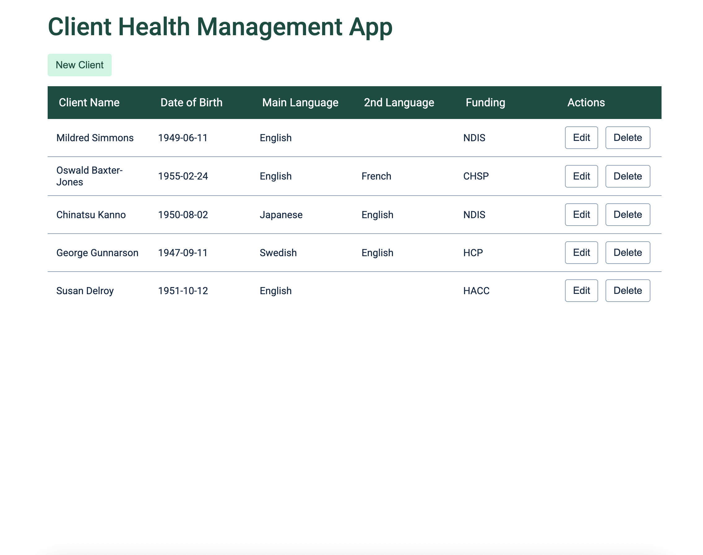
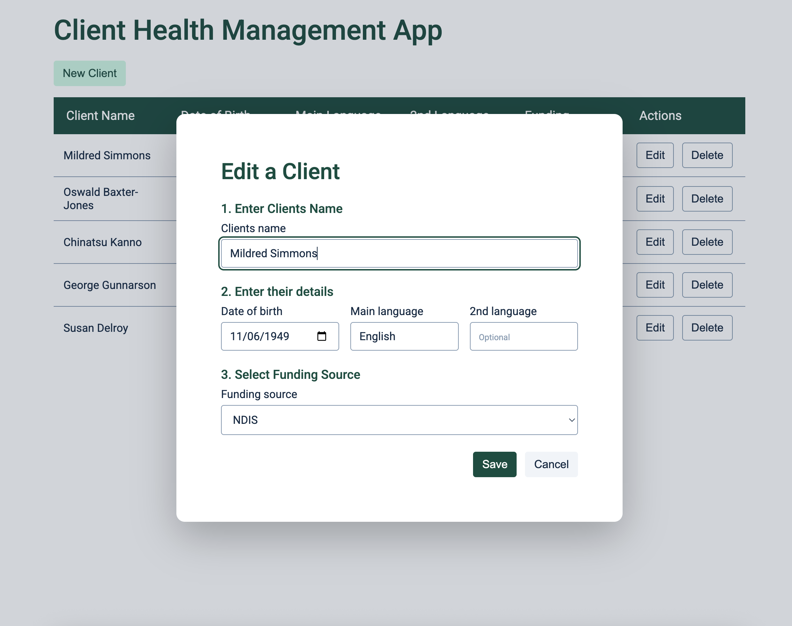

# Client Health Management App
This is a small full-stack app that allows the user to create, edit and delete their clients data via a modal connected to a SQLite Database.

## How to Run the App
1. Clone this repository
```
git clone https://github.com/Karis-T/client-health-app.git
cd client-health-app
```
2. Install dependencies and start app
```
npm install
npm start
```
3. Open `http://localhost:3001` in your browser

## Features
* CRUD operations: create, read, update and delete clients stored in a SQLite database
* Modal-based form design for adding and editing clients
* Funding source dropdown that is dynamically populated from the database
* Simple, clean CSS styling focused on clarity and usability

## Technical Design Decisions
* This project was my first exposure to Express.js. I designed and implemented it by combining my existing JS + SQL knowledge with learning through documentation and targeted practice
* Due to the limited timeframe I avoided learning TS/React to deliver a working, explainable solution. I opted for plain, static HTML,CSS & JS frontend files.
* I avoided a multi-page wizard to keep design user-oriented. Users would want to enter client data fast, so kept clicks and tabs to a minimum, while still keeping a 3 step process.
* I chose to keep the schema normalized with 2 entities (`clients` and `funding_sources`). This enables future information to be added to the `funding_sources` table such as contact information etc. It also allowed for a dropdown to be populated in the client form.

## Screenshots
### Client List View


### Add/Edit Client Modal
